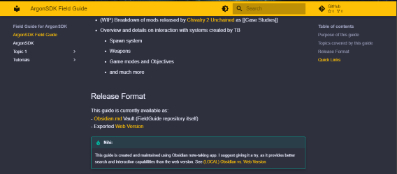
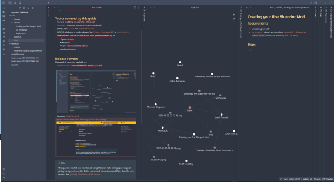

# ArgonSDK Field Guide

## Release Formats
This guide is currently available in two versons

## Exported [Web Version](https://knutschbert.github.io/ArgonSDK-FieldGuide/)

  
## [Obsidian.md](https://obsidian.md/) Vault (recommended)


### Steps to open this vault:
1. Clone this repository 
    ```sh
    git clone https://github.com/Knutschbert/ArgonSDK-FieldGuide
    ```
2. [Download](https://obsidian.md/download) and Install Obsidian
3. Start Obsidian
    - Select `Open Folder as Vault`
    - Navigate to your cloned repo

_This repository provides some basic plugins and theming_
