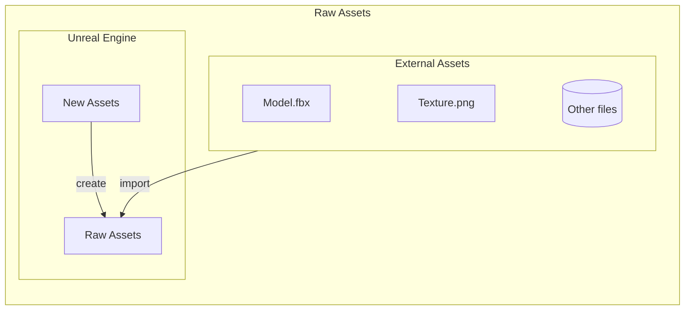
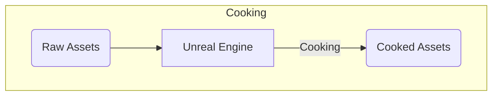
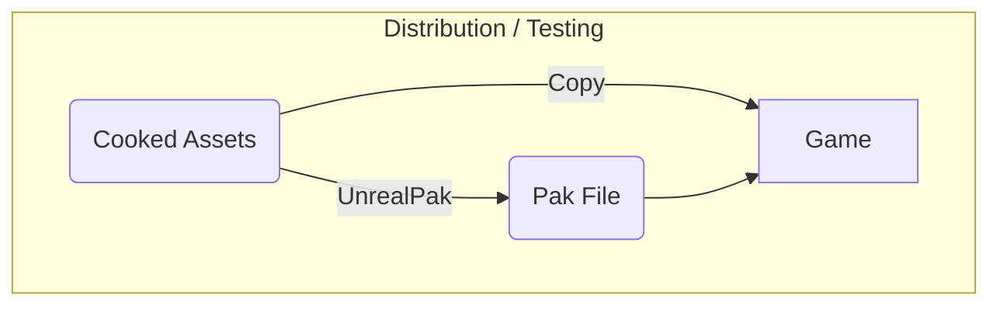
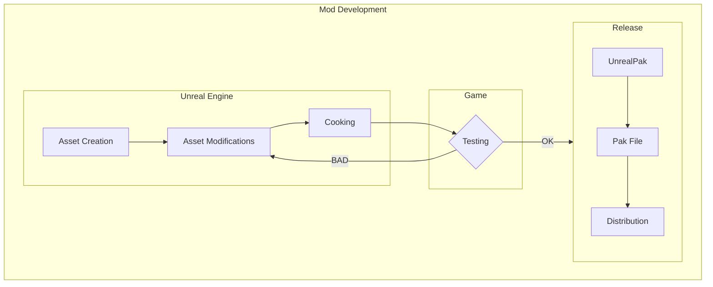

# Introduction
# What is an Asset?

> [!CITE] Unreal Engine Wiki
> Any piece of content in an Unreal Engine project is an **Asset**. You can think of Assets like building blocks that you use to create your game and application.
> Assets can be of many different types, such as Static Meshes, Materials, particle systems, and sound cues. Some Assets are created outside Unreal Engine (for example, in other 3D applications like Maya or 3ds Max). Other Assets, such as Blueprints, are created directly inside the engine.
# Asset Types

In terms of usability within Unreal Engine, there are two distinct asset types:
- Raw Assets
- Cooked Assets

> [!warning]
> Both asset types share the same extension (`.uasset`).

## Raw Assets
These are the assets that you can edit within UE. Any external file (e.g. PNG) will be converted into a raw asset when you import it.

Raw assets are located within `ArgonSDK/Content` folder.

## Cooked Assets

This type of assets generated by UE through a process called cooking. Cooked assets can be loaded directly by the game but are no longer editable within UE.

Cooked assets are located under:
`ArgonSDK/Saved/Cooked/WindowsNoEditor/TBL/Content`

### Loose vs Packaged assets

The game can load both PAKs and loose files (Copied from `ArgonSDK/Saved/..`). Distribution via UnchainedLauncher requires you to package your mods. This procedure is further explained in [[T5 Distributing your Mod]]

# Mod development process

On a high level, the development process can be described like this:

