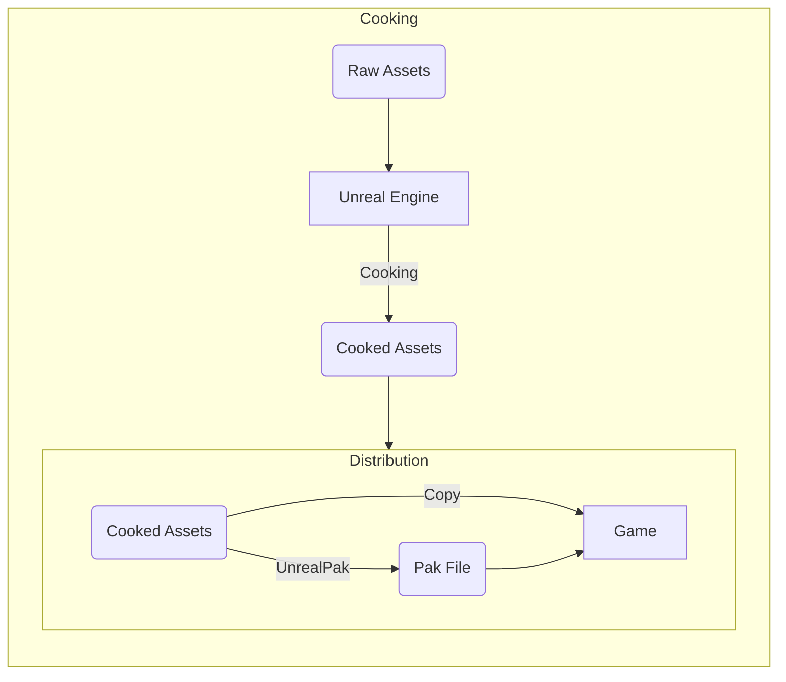

```mermaid
flowchart LR
subgraph Cooking
	direction TB
	A(Raw Assets) --> U[Unreal Engine] -- Cooking --> C(Cooked Assets) --> Distribution
end
subgraph Distribution
	direction LR
	C2(Cooked Assets) -- Copy --> cp[Game]
	C2 -- UnrealPak --> E(Pak File) --> cp
end
```

