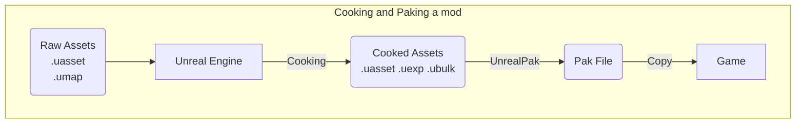

## Requirements
-  Unreal Engine 4.25.4
-  [recursively](https://explainshell.com/explain?cmd=git+clone+--recursive) cloned version of our  [[ArgonSDK#Repository]]
## YT Example

An example demonstrating the creation of a simple mod which executes a console command
Parts related to mod loading at the end of the video are outdated!

<iframe width="560" height="315" src="https://www.youtube.com/embed/ybTucFN7ZZM?si=-n7oT-m4kMjZT40X" title="YouTube video player" frameborder="0" allow="accelerometer; autoplay; clipboard-write; encrypted-media; gyroscope; picture-in-picture; web-share" allowfullscreen></iframe>


### Working directory
You may create mods and maps anywhere in the `Content\Mods` directory.

> [!Info]
> 
> Historically, the default directory for Mod Actors is `Content\Mods\AgMods\<ModName>\<ModName>.uasset`.  
> If you stick to this naming scheme, you don’t have to specify any asset when adding a Mod Marker ([[#2. Create a Mod Marker]]).
> Pak batch script provided in this tutorial also targets this base directory by default `Content\Mods\AgMods`
## 1. Create a Mod Actor

1. In the `Content Browser` window, create and enter a new directory, then right click and create a new Blueprint asset
2. Select `ArgonSDKModBase` as base class when prompted.
   ![[Pasted image 20241024133201.png]]
3. Name it as desired. Don’t use spaces

## 2. Create a Mod Marker

A Mod Marker is required for the mod loader to detect your newly created actor. You can use a single Mod Marker to tag multiple actors.

1. Right-Click and create a new Data Asset (`Miscellaneous -> Data Asset`) of class `DA_ModMarker`
2. You can leave the default filename or pick something else (e.g. `ModMarker`)
   ![[Pasted image 20241024133841.png]]
3. Open the Data Asset and add your ModBase actor to `Mod Actors`
   > [!Info]
   > You can omit this step if you’re using this base directory and naming scheme `Content\Mods\AgMods\<ModName>\<ModName>`
  - the `value` field is currently unused, in the future it may be displayed as part of the tooltip in main menu
   ![[Pasted image 20241024134125.png]]
## 3. Mod Settings
Open the Mod Actor asset (`MyFirstMod`). A new window should open with a list of properties
_When inside the Blueprint editor, click on `Class Defaults` to view and edit these settings._
### General Settings
![[Pasted image 20241024134558.png]]
Ignore `Duplicate` and `Mod Version Repl` fields.
`Ingame Mod Menu Widgets` specifies a map of widgets to be displayed as tabs during a match. See [[#In-Match UI]]
### Mod Loader Settings
![[Pasted image 20241024134623.png]]

| Flag | Description |
| ---- | ----------- |
| Silent Load|Don’t show `Loaded *** Version..` message during a match|
|Online Only| Only Unchained|
|Host Only| Only offline play or on an Unchained Server|
|Allow on Frontend| Load only on the `Frontend` map (main menu). Mod is instantly enabled when toggled|
|Clientside|Mod will load on the client only (Unchained and TB MP)|

## 4. Hello World
Let’s print something
1. Open the Mod Actor (`MyFirstMod`)
2. Click on `Open Full Blueprint Editor` if only the class defaults are visible
3. Right-Click and add a `Show Local Chat` node (wrapper for `ClientReceiveLocalizedChat`)
4. Connect it to the `Parent:BeginPlay` node
   ![[Pasted image 20241024162420.png]]
   Now as soon as the mod actor is loaded (spawned), our message will be displayed in the chat
## 5. Cooking and PAKing
See [[Introduction#Loose vs Packaged assets]] for general description.


### Option A1: Cook and Package in UE4 Editor

![[Pasted image 20241028150247.png]]
1. Locate `ModPackerWidget` in `Content/Scripts` directory and run it (`Right Click -> Run`)
2. Change the output directory
	- You can set it to the Chiv2 `Paks` directory. A running client will block pak replacement
3. Click on `Find` to locate mod markers, `Cook` if necessary

> [!Note]
> Options A1 and A2 support content replacement.
> Any assets placed in `_Content` subdirectory inside a mod’s folder will be saved as `TBL/Game/...`

### Option A2: Cook and Package with Python script
The Widget Blueprint in [[#Option A1 Cook and Package in UE4 Editor]] is a wrapper for the `build.py` script located in `ArgonSDK/Scripts`.
The script can be called manually for a more streamlined packaging process.

Supported functions are: `cook`, `pak`
#### Default values
Open the script in a text editor and set following paths valid for your setup.
This step is optional but it will let you omit some parameters when calling the script
```py
PROJ_PATH_DEFAULT = 'M:/chivmodding_i/SDK/ArgonSDK/TBL.uproject'

UE4_PATH_DEFAULT = 'H:/epic/UE_4.25/Engine/'

OUTPUT_DIR_DEFAULT = 'M:/chivmodding_i/SDK/ArgonSDK/Scripts'
```
#### Cooking
```
usage: build.py cook [-h] [uproject_path] [ue4_root]

positional arguments:
  uproject_path  path to .uproject file
  ue4_root       path to ue4 ("H:/epic/UE_4.25/Engine/")
```
#### Paking
```
usage: build.py pak [-h] mod_name [mod_dir] [dest_dir] [uproject_path] [ue4_root]

positional arguments:
  mod_name       Name of the mod (resulting pak) (or comma separated list)
  mod_dir        mod directory, base directory (ends with /) or comma-separated list. defaults to "/Game/Mods/AgMods/<mod_name>"
  dest_dir       Output directory. Will be created on spawn
  uproject_path  path to .uproject file
  ue4_root       path to ue4 ("H:/epic/UE_4.25/Engine/")
```

Single mod: `python build.py pak DripSync` will create `DripSync.pak` from source in `/Game/Mods/AgMods`
Multiple mods (these commands yield same results):
```sh
$ python build.py pak DripSync,ModMenu /Game/Mods/AgMods/DripSync,/Game/Mods/AgMods/ModMenu 
$ python build.py pak DripSync,ModMenu /Game/Mods/AgMods/ 
$ python build.py pak DripSync,ModMenu

Mod "DripSync": "/Game/Mods/AgMods/DripSync"
27 files added to "M:/chivmodding_i/SDK/ArgonSDK/Scripts\DripSync.pak"
Mod "ModMenu": "/Game/Mods/AgMods/ModMenu"
36 files added to "M:/chivmodding_i/SDK/ArgonSDK/Scripts\ModMenu.pak"
```
### Option B: Cook and Package with a Batch script
>[!Warning]
>This method is suitable if:
> - Your mods are located in `Content\Mods\AgMods\<ModName>` directory (naming not important)
> - Your mod has no asset replacements (e.g. Heraldry replacement) 

1. Locate build.bat in `ArgonSDK\Scripts\build.bat`
	- [ArgonSDK github: build.bat](https://github.com/Chiv2-Community/ArgonSDK/blob/main/Scripts/build.bat)
2. Edit your local file and set `CHIVALRY_PATH` and `UE4_PATH` variables`_
   ```
   set "CHIVALRY_PATH=I:\Epic Games\Chivalry2_c\TBL\Content\Paks"
	set "UE4_PATH=I:\Epic Games\UE_4.25\Engine\Binaries\Win64"  
	
	
   ```
   
   _Optionally create a shortcut and set `CHIV2_LAUNCH_LNK` variable to launch the game with `-l` parameter_
	 ```
		set "CHIV2_LAUNCH_LNK=I:\Epic Games\Chivalry 2 - EGS.url"
   ```
3. Run the script using following syntax:
   `build.bat <ModName> -c -l`
   `-c` : also cook the project
   `-l` : launch game after paking
   
   _e.g. `build.bat DeathRecap -c` followed by `build.bat ModMenu -l` to cook both and launch afterwards_
   
   > [!Info]
   > The script will create a new output directory under `ArgonSDK\Scripts\Paks`. `<ModName>.pak` and `<ModName.txt>` are produced
   > It also copies the output .pak file to your Chivalry 2’s `Paks` directory.
   

### Option C: Cook and package manually
1. Save your assets and click on `File -> Cook Content for Windows` to start the cooking process.
	![[Pasted image 20241024142331.png]]
	- It may take a while to cook the entire project when cooking for the first time. 
	- A large number of errors not related to your mod actor may appear in the logs. These are expected as we’re dealing with a bunch of dummy assets. It should not influence your mod actor.
	- Resulting (Cooked) assets are written to `ArgonSDK\Saved\Cooked\WindowsNoEditor\TBL\Content`
	  ![[Pasted image 20241024143030.png]]
2. Refer to ArgonSDK Wiki and use `UnrealPak-With-Compression.bat`
   [ArgonSDK Wiki:Step 2: paking](https://github.com/Chiv2-Community/ArgonSDK?tab=readme-ov-file#step-2-paking)
## 6. In-Match UI (Optional)

You can register multiple widgets that will load together with your mod. These will be displayed in the Pause menu. 
The button in upper left corner toggles menu visibility.

![[Pasted image 20241024140041.png]]

To add a new tab widget, create a Widget Blueprint of class `IngameModMenuBaseWidget` and add it together with desired name to the field in [[#General Settings]]

![[Pasted image 20241024140109.png]]

